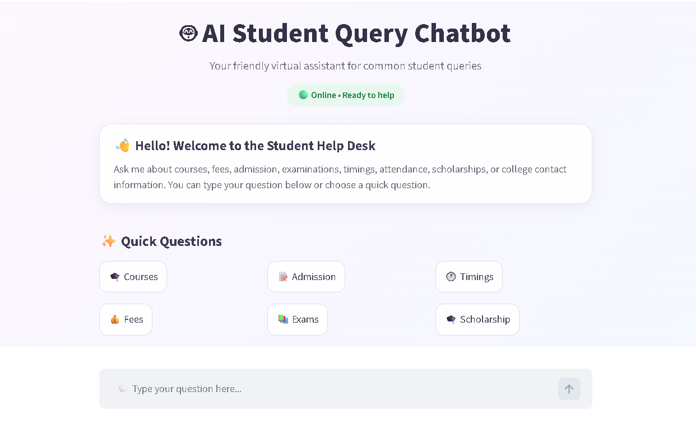
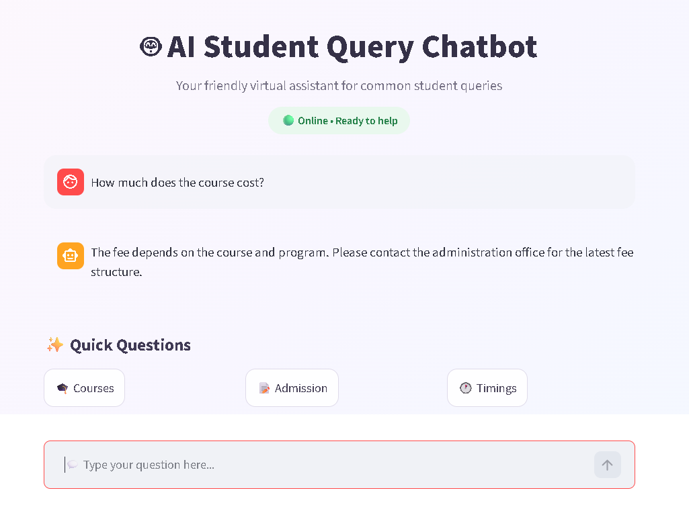
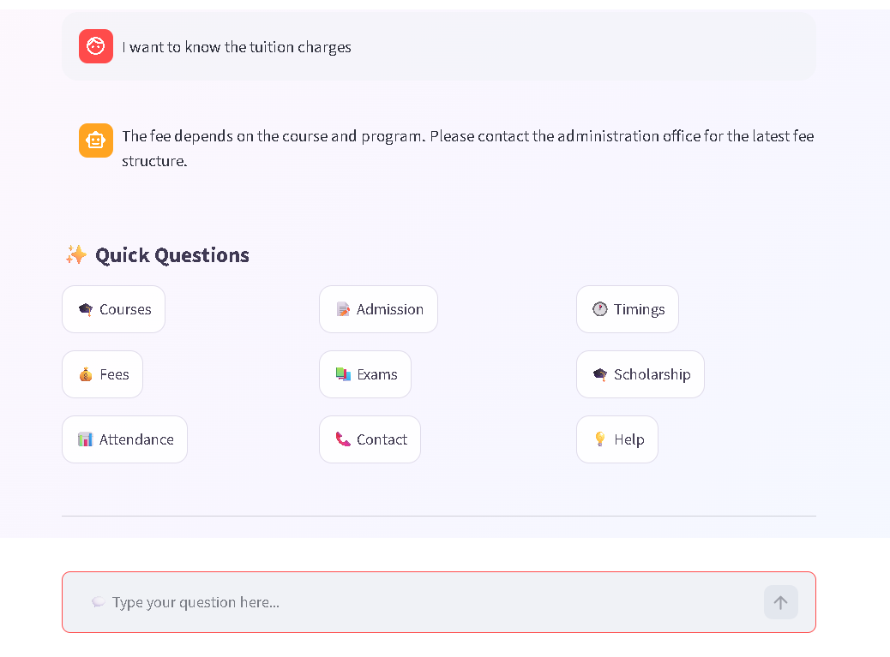
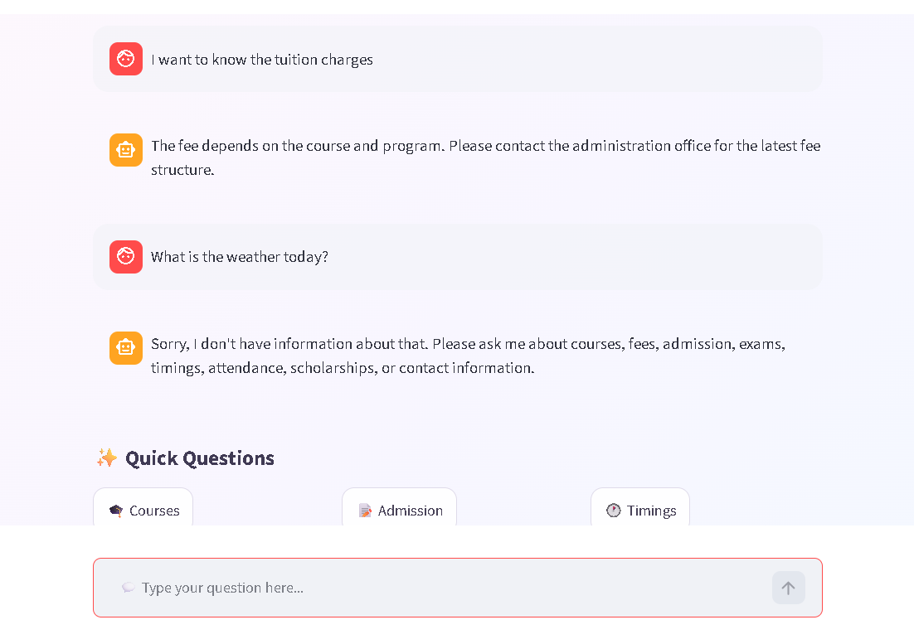
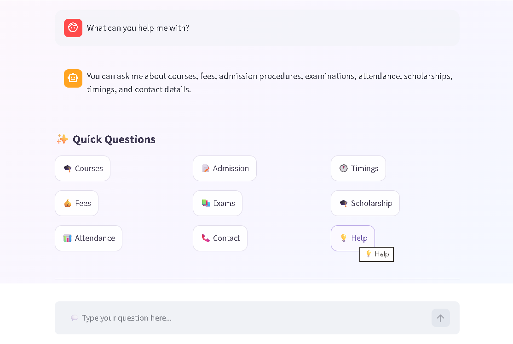

<div align="center">

# 🤖 AI Student Query Chatbot

### 🌸 Your friendly little AI assistant for student queries 🌸

<p>
  
  
  
  
</p>

<p>
  <b>💬 Ask a question.</b> &nbsp;•&nbsp;
  <b>🧠 Let the chatbot understand it.</b> &nbsp;•&nbsp;
  <b>✨ Get a helpful answer.</b>
</p>

</div>

---

## 🌷 A Little About the Project

**AI Student Query Chatbot** is a lightweight web-based chatbot created to answer common academic and administrative questions that students frequently ask.

The project combines **Python, Natural Language Processing (NLP), JSON-based intent data, pattern matching, and Streamlit** to create a simple conversational student-support system.

Instead of training a machine-learning model, the chatbot preprocesses the user's text, compares it with predefined query patterns, identifies the most relevant intent, and returns a predefined response.

> 🌸 **Simple idea:** make getting routine student information feel as easy as having a tiny virtual help desk.

---

## 🪄 What Can It Do?

The chatbot currently supports **11 intents** and **148 example query patterns**.

| ✨ | Intent | 💬 Example |
|:---:|---|---|
| 👋 | **Greeting** | Hello! |
| 🎓 | **Courses** | What courses are available? |
| 💰 | **Fees** | How much does the course cost? |
| 📝 | **Admission** | What documents do I need to apply? |
| 🕐 | **Timings** | What are the college timings? |
| 📚 | **Exams** | When are semester exams? |
| 📊 | **Attendance** | What percentage of attendance do I need? |
| 🎓 | **Scholarship** | Are scholarships available? |
| 📞 | **Contact** | How can I contact the college? |
| 💡 | **Help** | What can you help me with? |
| 🌷 | **Goodbye** | Thank you! |

---

## 💖 Features

- 💬 Interactive conversational interface
- 🧠 NLP-based text preprocessing
- 🔎 Exact and scored pattern matching
- 🎯 Intent detection with a confidence threshold
- 📚 11 supported student-query intents
- ✨ 148 predefined query patterns
- 🎲 Multiple predefined responses per intent
- 🚫 Controlled fallback for unknown questions
- ⚡ Quick-question buttons
- 🗨️ Persistent chat history
- 🧹 Clear conversation option
- 🌐 Streamlit web application
- 📄 JSON-based knowledge base

---

## 🖼️ A Little Preview

### 🏡 Home — Meet Your Student Help Desk

<p align="center">
  
</p>

---

### 💰 Asking About Fees

<p align="center">
  
</p>

---

### 🧠 Understanding Different Wording

The chatbot can handle a differently worded version of a known query through its preprocessing and pattern-matching logic.

<p align="center">
  
</p>

---

### 🚫 Unknown Query Handling

The chatbot does not force unrelated questions into an existing intent. Instead, it provides a controlled fallback response.

<p align="center">
  
</p>

---

### 💡 Built-in Help

<p align="center">
  
</p>

---

## 🧠 How It Works

```text
                    👩‍🎓 Student
                         │
                         ▼
                  💬 User Question
                         │
                         ▼
                🔤 Text Normalization
                         │
                         ▼
                🧹 NLP Preprocessing
                         │
             ┌───────────┼───────────┐
             │           │           │
        Tokenization  Stopwords   Stemming
             │           │           │
             └───────────┼───────────┘
                         ▼
                 🔎 Pattern Matching
                         │
                         ▼
                  🎯 Intent Detection
                         │
                  ┌──────┴──────┐
                  │             │
                Match        No Match
                  │             │
                  ▼             ▼
             🤖 Response     💭 Fallback
                  │             │
                  └──────┬──────┘
                         ▼
                      💬 Reply
```

---

## 🔬 NLP Pipeline

The user's question passes through a small preprocessing pipeline before intent matching:

| Step | What happens? |
|---|---|
| 1️⃣ **Lowercasing** | Converts text to lowercase |
| 2️⃣ **Punctuation Removal** | Removes unnecessary punctuation |
| 3️⃣ **Tokenization** | Splits the sentence into individual words |
| 4️⃣ **Stopword Removal** | Removes common words that add little matching value |
| 5️⃣ **Stemming** | Reduces words to their stems using the Porter Stemmer |
| 6️⃣ **Pattern Matching** | Compares the processed query with dataset patterns |

### 🎯 Matching Strategy

The chatbot uses a two-stage approach:

**Stage 1 — Exact Match**  
The normalized user query is first compared directly with normalized dataset patterns.

**Stage 2 — Scored Match**  
If no exact match exists, the chatbot calculates overlap between the meaningful words in the user query and each predefined pattern.

A confidence threshold is used so that unrelated questions can receive the fallback response instead of being assigned to an unrelated intent.

---

## 🛠️ Tech Stack

| Technology | Purpose |
|---|---|
| 🐍 **Python** | Core application and chatbot logic |
| 🧠 **NLTK** | Tokenization, stopword removal and stemming |
| 🌐 **Streamlit** | Interactive web interface |
| 📄 **JSON** | Intent, pattern and response storage |
| 🔤 **Regular Expressions** | Text normalization and punctuation removal |
| 💻 **VS Code** | Development environment |

---

## 📁 Project Structure

```text
AI-Student-Query-Chatbot/
│
├── 📂 dataset/
│   └── student_queries.json
│
├── 🤖 chatbot.py
├── 🌐 app.py
├── ⚙️ setup_nltk.py
├── 📦 requirements.txt
├── 📖 README.md
├── 🚫 .gitignore
│
└── 📂 assets/
    ├── home.png
    ├── fee-query.png
    ├── attendance-query.png
    ├── nlp-variation.png
    ├── fallback.png
    └── help.png
```

---

## 🚀 Run It Locally

### 1️⃣ Clone the repository

```bash
git clone https://github.com/harshadubey46-dev/AI-Student-Query-Chatbot.git
```

### 2️⃣ Enter the project folder

```bash
cd AI-Student-Query-Chatbot
```

### 3️⃣ Install dependencies

```bash
pip install -r requirements.txt
```

### 4️⃣ Download the required NLTK resources

```bash
python setup_nltk.py
```

### 5️⃣ Launch the chatbot

```bash
streamlit run app.py
```

Then open the Streamlit URL shown in the terminal. 🌐✨

---

## 🧪 Testing

The chatbot was tested in three rounds:

### 🌸 Round 1 — Supported Intents

All supported intents were tested with direct queries such as:

```text
Hello
What courses are available?
How much does the course cost?
How can I apply for admission?
What are the college timings?
When are semester exams?
Can I write exams with low attendance?
Are scholarships available?
How can I contact the college?
What can you help me with?
Thank you
```

### 🧠 Round 2 — NLP Variations

Different wording was tested to check whether the matching logic could identify the same intent:

```text
I want to know the tuition charges
What documents do I need to apply?
Where can I check my exam dates?
What percentage of attendance do I need?
Is financial assistance available for students?
How do I reach the administration?
```

### 🚫 Round 3 — Unknown Queries

Unrelated questions were also tested to verify that the chatbot used its fallback mechanism rather than selecting an unrelated intent.

---

## 🌱 Future Scope

The current project is intentionally lightweight. It can later be extended with:

- 🧠 Machine-learning-based intent classification
- 💾 Database integration
- 📚 College FAQ/document integration
- 🔐 Student authentication
- 🗣️ Voice interaction
- 🌍 Multilingual support
- ☁️ Cloud deployment
- 💬 More conversational responses

---

## 🌸 Why This Project?

Students repeatedly ask the same kinds of academic and administrative questions.

This project explores a simple solution:

> **What if a student could just ask instead of searching? 💬✨**

The chatbot demonstrates how basic NLP and pattern matching can turn a structured FAQ dataset into an interactive student-support application.

---

<div align="center">

## 💗 Built with Python, NLP & a little curiosity

### 🤖 AI Student Query Chatbot

**Ask. Chat. Learn. ✨**

<br>

⭐ If you found this project interesting, consider giving it a star!

</div>
